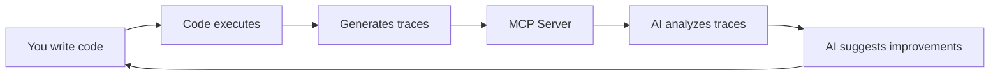

# AI-Assisted Coding Enhanced by Traces: The Developer Experience Vision

## The Real Problem We're Solving

**Current AI Coding Reality:**
- You ask Claude/Copilot to fix a performance issue
- It reads your code and makes educated guesses
- Suggests optimizations that might work
- You implement them, test, find out it made things worse
- Repeat until frustrated

**With Trace-Enhanced AI Coding:**
- You ask Claude to fix a performance issue
- Claude queries actual trace data from your last 100 executions
- Sees the REAL bottleneck (not what it assumes from code)
- Writes optimization targeting the actual problem
- Tests it, analyzes new traces, confirms improvement
- Done in one shot

## The Killer Demo: Live AI Debugging with Traces

### Scenario: "Claude, why is my journal generation slow?"

**Without Traces (Current State):**
```
User: "The journal generation feels slow"
Claude: "Let me look at your code... I see you're making multiple AI calls. 
        Maybe try batching them? Or perhaps the git diff processing is slow?"
User: "I tried batching, didn't help"
Claude: "Hmm, maybe it's the chat message filtering?"
User: [Tests] "Nope, still slow"
[20 minutes of guessing later...]
```

**With Trace-Enhanced AI (The Vision):**
```
User: "The journal generation feels slow"
Claude: [Queries recent traces via MCP] 
        "I see from your last 10 executions that journal.generate takes 15.6s average.
         Breaking it down:
         - summary.generate: 9.04s (58%)
         - dialogue.generate: 4.89s (31%) 
         - technical-decisions: 1.67s (11%)
         
         But here's the interesting part - they're running sequentially when they could 
         run in parallel. Let me fix that..."
         
[Claude rewrites the code to parallelize, tests it, analyzes new trace]

Claude: "After my changes, total time dropped to 9.1s (the time of the slowest operation).
        The trace confirms all three are now running concurrently."
```

## The Developer Experience Transformation

### 1. **AI Understands Your Actual System**

**Current**: AI reads your code files, imagines how they work
**Vision**: AI reads your traces, KNOWS how they work

**Demo Power Move**: 
```
User: "Claude, what actually happens when someone commits to my repo?"
Claude: [Analyzes traces] "Based on the last 50 commits:
        1. Post-commit hook triggers (avg 50ms)
        2. Context gathering runs (avg 346ms, queries 196 chat messages on average)
        3. Parallel AI generation begins:
           - Summary: 9.6s avg (4,766 input tokens typical)
           - Dialogue: 8.2s avg
           - Technical: 14.7s avg
        4. Journal file written (20ms)
        Total: 15.5s average, 97.8% spent on OpenAI API calls"
```

### 2. **AI Validates Its Own Code Changes**

**Current**: AI writes code, you test it manually
**Vision**: AI writes code, runs it, analyzes traces, fixes issues before you even see them

**Demo Power Move**:
```
User: "Add caching to speed up repeated journal regeneration"
Claude: [Writes caching layer]
        "Let me test this with a cached scenario..."
        [Runs code, analyzes trace]
        "Interesting - the trace shows my cache key isn't unique enough. 
         Multiple commits are getting the same cache entry. Let me fix that..."
        [Fixes and retests]
        "Now the trace confirms: cache hits skip AI calls entirely, 
         dropping regeneration from 15s to 0.03s"
```

### 3. **AI Discovers Hidden Problems**

**Current**: You notice something is slow/broken, ask AI to fix it
**Vision**: AI proactively analyzes traces and suggests improvements

**Demo Power Move**:
```
Claude: "I noticed something in your recent traces - the dialogue.generate span 
        shows you're sending the entire chat history (12,499 tokens) but the 
        output is only using messages from the last hour. You could filter the 
        input to recent messages and cut your API costs by 80%."
```

### 4. **AI Learns Your Patterns**

**Current**: Every time you start a new conversation, AI has amnesia
**Vision**: AI learns from your historical traces

**Demo Power Move**:
```
User: "Why did the journal generation fail for commit abc123?"
Claude: [Queries specific trace] 
        "The trace shows an OpenAI timeout after 30 seconds. Looking at patterns,
        this happens for commits with >500KB diffs. Your timeout is too aggressive
        for large commits. Also, I notice this is the 5th timeout this week - 
        all for commits over 500KB."
```

## The MCP Server Integration Magic

### Real-Time Feedback Loop


### The Live Coding Session
**You're coding with AI assistance:**
1. You write a new function
2. It automatically gets traced when you test it
3. AI immediately sees the trace
4. AI says: "I notice your function makes 10 database calls in a loop. Want me to refactor it to batch them?"
5. You say yes
6. AI refactors, tests, confirms via traces it now makes 1 batched call
7. All without you leaving your editor

## The Conference Demo Script

### Act 1: "The Problem" (2 minutes)
Show traditional AI coding:
- Ask AI to optimize something
- AI guesses wrong
- Multiple iterations of frustration
- "There must be a better way..."

### Act 2: "The Solution" (3 minutes)
Enable trace-enhanced AI:
- Same request to AI
- AI queries actual traces
- Identifies real problem immediately
- Fixes it in one shot
- "The AI isn't guessing - it KNOWS"

### Act 3: "The Magic" (5 minutes)
Live coding with trace-aware AI:
1. **Discovery**: "Claude, how does my system actually work?" → Full system analysis from traces
2. **Debugging**: "Why did this fail?" → AI reads exact failure trace
3. **Optimization**: "Make this faster" → AI sees actual bottlenecks
4. **Validation**: AI tests its own changes and proves they work via traces
5. **Learning**: "What patterns do you see?" → AI reveals insights from trace history

## Why This Matters (The Pitch)

### For Developers
- **No more guessing**: AI knows what your code actually does
- **Faster debugging**: AI sees the exact execution that failed
- **Confident changes**: AI validates its suggestions with real data
- **Continuous learning**: AI gets smarter about your system over time

### For the Industry
- **Changes AI coding from "helpful" to "expert"**
- **Bridges the gap between AI's theoretical knowledge and your system's reality**
- **Makes AI a true pair programmer that understands your production system**
- **Sets new standard for AI-assisted development**

## Implementation Approach

### Phase 1: Basic Integration (What we have)
- ✅ OpenTelemetry instrumentation
- ✅ Traces flowing to Datadog
- ✅ MCP server available

### Phase 2: AI Can Read Traces (Next)
- [ ] Connect Claude to Datadog MCP server
- [ ] Implement trace querying patterns
- [ ] Create prompt templates for trace analysis

### Phase 3: AI-Driven Development
- [ ] Automatic trace analysis on code execution
- [ ] Proactive problem identification
- [ ] Self-validating code changes
- [ ] Pattern learning from trace history

### Phase 4: The Full Vision
- [ ] IDE integration with real-time trace feedback
- [ ] AI that learns your system's behavior patterns
- [ ] Predictive performance analysis
- [ ] Automated optimization suggestions

## The "Holy Shit" Moments for the Audience

1. **When AI correctly identifies a bottleneck without reading code**
   - "How did it know that?" → "It read the traces"

2. **When AI fixes its own broken code by analyzing traces**
   - "It's debugging itself!"

3. **When AI reveals something you didn't know about your system**
   - "I had no idea we were making that many API calls"

4. **When AI predicts a problem before it happens**
   - "Based on trace patterns, this will timeout on large inputs"

## The Tagline

**"Stop Teaching AI to Read Code. Teach It to Read Reality."**

Or:

**"Your AI Assistant Doesn't Need to Guess Anymore."**

Or:

**"What if Your AI Assistant Could See Your Code Running?"**

## Why This is Different from "Traces are Good"

This isn't about:
- Monitoring production
- Finding errors after they happen
- DevOps observability
- SRE practices

This IS about:
- **AI that understands your running system**
- **Development-time intelligence**
- **Code that writes itself correctly the first time**
- **AI as a true expert on YOUR system, not just programming in general**

The revolution: **Traces aren't just for debugging anymore. They're for teaching AI how your system actually works.**

---

**Document Purpose**: Vision document for conference presentation on AI-enhanced development via traces
**Target Audience**: Developers frustrated with AI assistants that don't understand their actual systems
**Key Innovation**: Using OpenTelemetry traces to give AI assistants real-world system intelligence
**Conference Hook**: Live demo of AI fixing real problems by reading traces, not guessing from code