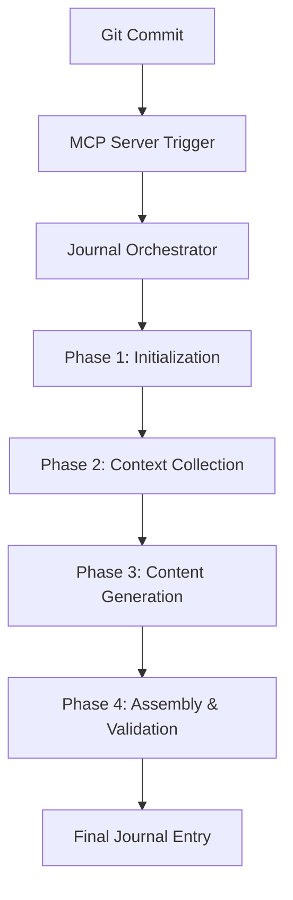
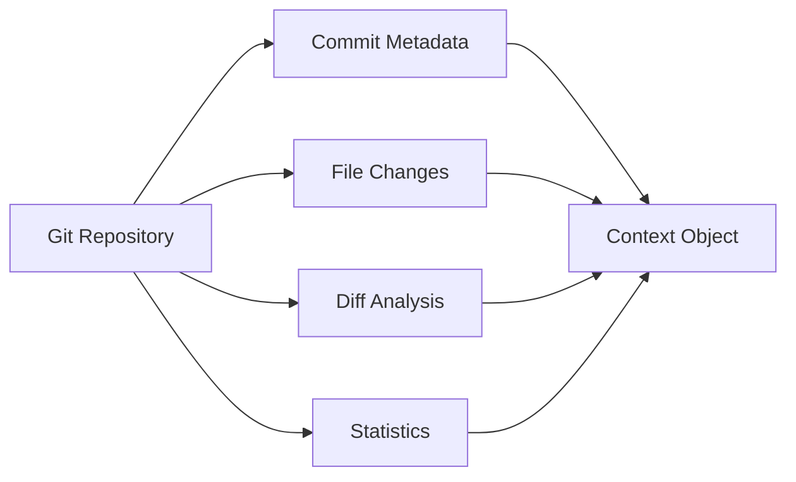
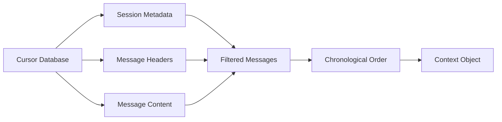
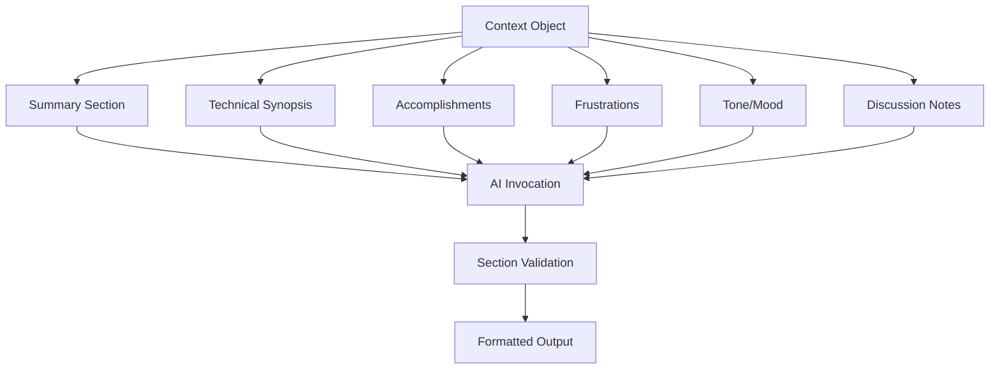

# Journal Generation Workflow

## Overview

The old mcp-commit-story project implemented a complex, multi-phase journal generation workflow triggered by git commits. This document breaks down the complete workflow from trigger to final journal entry.

## High-Level Workflow



## Phase 1: Initialization

### Purpose
Set up the journal generation process with proper tracking and configuration.

### Steps
1. **Commit Hash Validation**
   - Receive target commit hash from trigger
   - Validate commit exists in git repository

2. **Telemetry Setup**
   - Initialize OpenTelemetry span tracking
   - Set up performance monitoring
   - Configure error tracking

3. **Configuration Loading**
   - Load `.mcp-commit-storyrc.yaml` configuration
   - Validate required settings (journal path, etc.)
   - Set up AI provider configuration

4. **Journal Context Setup**
   - Determine journal file location
   - Initialize timestamp for entry
   - Set up metadata tracking

## Phase 2: Context Collection

### Purpose
Gather comprehensive context from multiple data sources to inform journal generation.

### Data Sources & Collection Process

#### Git Context Collection


**Collected Data:**
- Commit hash, author, date, message
- Changed files list with modification types
- Diff summaries and file-level diffs
- Commit size classification (small/medium/large)
- File statistics (additions, deletions, modifications)

**Optimizations:**
- File sampling for large commits (>50 files)
- Diff truncation for performance
- Binary file detection and exclusion

#### Chat History Collection


**Collection Process:**
1. Query Cursor's workspace SQLite database
2. Extract session metadata within time window
3. Retrieve message headers for relevant sessions  
4. Fetch individual message content
5. Filter and sort messages chronologically

**Filtering Rules:**
- Time-based filtering around commit timestamp
- Remove empty or system messages
- Extract only text content (ignore tool calls)
- Preserve user/assistant role mapping

#### Journal Context Collection
- Extract most recent journal entry
- Parse existing journal sections
- Gather reflection and context data
- Maintain journal file metadata

### Context Processing
1. **Security Sanitization**
   - Remove potentially sensitive information
   - Filter out API keys and secrets
   - Sanitize file paths and personal data

2. **Performance Optimization**
   - Limit context size to prevent token overflows
   - Implement sampling for large datasets
   - Set performance thresholds (500ms warnings)

3. **Error Handling**
   - Graceful degradation if sources fail
   - Fallback to available data sources
   - Detailed error logging for debugging

## Phase 3: Content Generation

### Purpose
Use AI to generate six distinct sections of the journal entry, each with specialized prompts.

### Section Generation Workflow


### AI Invocation Process

#### Per-Section Generation
For each of the 6 sections:

1. **Prompt Construction**
   - Load section-specific prompt template
   - Format context data as JSON string
   - Combine prompt + context into system/user message structure

2. **AI API Call**
   - Send to OpenAI gpt-4o-mini model
   - 30-second timeout per call
   - Retry logic (3 attempts, 1-second delays)

3. **Response Processing**
   - Extract text response
   - Basic validation and sanitization
   - Error handling with fallback content

#### AI Provider Details
- **Model**: gpt-4o-mini
- **Structure**: System message (prompt) + User message (context)
- **Timeout**: 30 seconds per call
- **Error Handling**: Returns empty string on failure

### Generated Sections

1. **Summary Section**
   - Narrative overview of changes
   - Focus on "what changed and why"
   - Conversational, authentic tone

2. **Technical Synopsis**
   - Implementation details and architecture
   - Code-focused technical analysis
   - Design decisions and patterns

3. **Accomplishments**
   - Successful work and progress made
   - Technical achievements and learning
   - Concrete, specific language

4. **Frustrations**
   - Challenges and blocking issues
   - Developer's expressions of difficulty
   - Technical frustration indicators

5. **Tone/Mood**
   - Emotional context analysis
   - Mood indicators from chat
   - Authentic emotional expression

6. **Discussion Notes**
   - Relevant chat conversation excerpts
   - Meaningful technical discussions
   - Verbatim quotes with attribution

## Phase 4: Assembly & Validation

### Purpose
Combine generated sections into final journal entry with proper formatting and validation.

### Assembly Process

1. **Section Validation**
   - Check each section for content
   - Validate against expected format
   - Handle missing or failed sections

2. **Fallback Content**
   - Provide default content for failed sections
   - Maintain journal structure integrity
   - Log validation issues

3. **Journal Entry Construction**
   - Create structured `JournalEntry` object
   - Add timestamp and commit metadata
   - Format sections as Markdown

4. **Final Formatting**
   - Generate Markdown with section headers
   - Preserve original language and context
   - Apply consistent formatting rules

### Output Structure
```markdown
# [Timestamp] - Commit [Hash]

## Summary
[Generated summary content]

## Technical Synopsis
[Generated technical content]

## Accomplishments
[Generated accomplishments content]

## Frustrations
[Generated frustrations content]

## Tone/Mood
[Generated mood analysis]

## Discussion Notes
[Generated discussion excerpts]

---
Commit: [full_commit_hash]
Generated: [timestamp]
```

## Error Handling & Resilience

### Graceful Degradation Strategy
- Continue processing even if individual components fail
- Provide meaningful fallback content
- Preserve partial results when possible

### Error Scenarios
1. **Git context failure**: Use minimal commit info
2. **Chat history failure**: Generate from git context only
3. **AI generation failure**: Use template or empty content
4. **Multiple failures**: Create basic entry with available data

### Performance Monitoring
- Track generation time per phase
- Monitor AI API response times
- Log performance warnings (>500ms operations)
- Record success/failure metrics

## Workflow Complexity Assessment

### Strengths
1. **Comprehensive Context**: Gathers rich, multi-source data
2. **Robust Error Handling**: Continues despite individual failures
3. **Structured Approach**: Clear phase separation and responsibilities
4. **Performance Awareness**: Monitoring and optimization

### Complexity Issues (Bloat)
1. **Over-Orchestration**: Multiple abstraction layers
2. **Excessive Telemetry**: Detailed tracking of every operation
3. **Complex Configuration**: Multiple configuration points
4. **Heavy AI Usage**: 6+ AI calls per journal entry

### Simplification Opportunities for MVP
1. Reduce to 2-3 key sections instead of 6
2. Eliminate orchestrator layer
3. Simplify error handling
4. Remove excessive telemetry
5. Streamline context collection