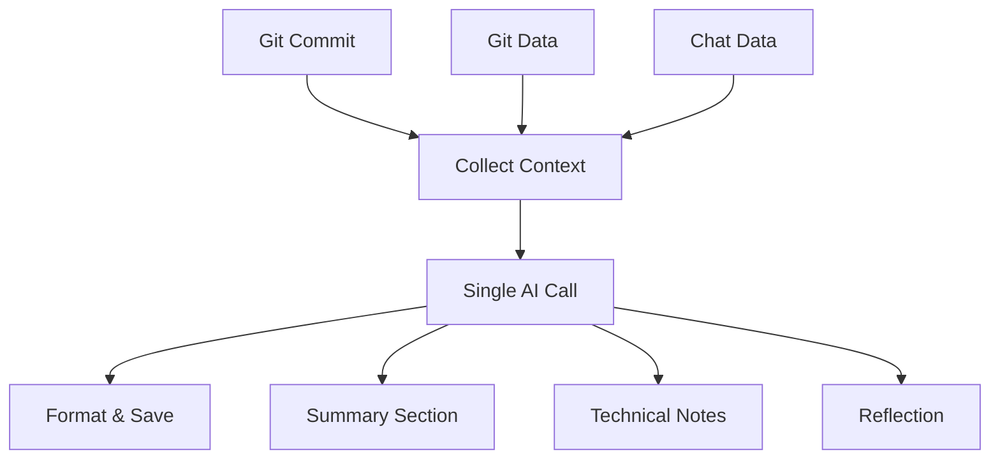

# MVP Recommendations

## Executive Summary

Based on analysis of the old mcp-commit-story project, this document provides specific recommendations for building a streamlined MVP that captures the core value while eliminating bloat.

## Core Value Identification

### What Made the Old System Valuable
1. **Automated Context Collection**: Gathering git + AI chat data automatically
2. **Anti-Hallucination AI Prompts**: Preventing AI from inventing information
3. **Authentic Developer Voice**: Preserving original language and expression
4. **Multi-Source Context**: Combining git commits with AI chat conversations

### What Was Bloated
1. **Over-Orchestration**: Complex workflow management and abstraction layers
2. **Excessive Telemetry**: Detailed metrics and performance tracking everywhere
3. **Too Many Sections**: 6 separate AI-generated sections per entry
4. **Feature Creep**: Daily/weekly/monthly/yearly summaries
5. **Complex Error Handling**: Multiple retry mechanisms and fallback systems

## MVP Architecture Recommendations

### Simplified Tech Stack
```
Technology Choices:
├── Language: TypeScript/Node.js (faster prototyping than Python)
├── AI Provider: OpenAI API (proven, simple)
├── Storage: Simple file system (no complex database)
├── Configuration: Single JSON config file
└── Trigger: Git hook or manual CLI command
```

### Streamlined Workflow


## Recommended MVP Features

### Phase 1: Core MVP (Week 1-2)
1. **Basic Git Context Collection**
   - Commit hash, message, author, timestamp
   - File changes list (additions/deletions/modifications)
   - Simple diff summary (avoid complex parsing)

2. **Simplified AI Generation**
   - Single AI call generating 2-3 sections
   - Combined prompt instead of 6 separate calls
   - JSON structured output for consistency

3. **Basic Journal Entry Format**
   ```markdown
   # [Date] - [Commit Summary]
   
   ## Summary
   [What changed and why - from git + chat context]
   
   ## Technical Notes
   [Key implementation details and decisions]
   
   ## Reflection
   [Challenges, learnings, and thoughts]
   
   ---
   Commit: [hash]
   Generated: [timestamp]
   ```

### Phase 2: Enhanced Context (Week 3-4)
1. **Claude Code Chat Integration**
   - Simple JSONL file parsing instead of SQLite complexity
   - Time-windowed chat filtering around commit
   - Basic message extraction and formatting

2. **Improved AI Prompting**
   - Single comprehensive prompt with structured output
   - Anti-hallucination rules from old system
   - Context size management

### Phase 3: Polish & Usability (Week 5-6)
1. **Simple CLI Interface**
   - `commit-story generate [commit-hash]`
   - `commit-story config`
   - `commit-story setup`

2. **Basic Configuration**
   ```json
   {
     "journal_path": "./journal/",
     "openai_api_key": "...",
     "chat_logs_path": "./claude-logs/",
     "max_context_size": 8000
   }
   ```

## Implementation Simplifications

### 1. Eliminate Complex Orchestration
**Old System**: Orchestrator → Workflow → Generate → Provider
**MVP**: Direct function calls in simple sequence

```typescript
// Instead of complex orchestration
async function generateJournalEntry(commitHash: string) {
  const context = await collectContext(commitHash);
  const entry = await generateWithAI(context);
  await saveEntry(entry);
}
```

### 2. Reduce AI Calls
**Old System**: 6+ separate AI calls per journal entry
**MVP**: 1 AI call with structured JSON output

```typescript
const prompt = `
Generate a development journal entry with these sections:
- summary: What changed and why
- technical_notes: Key implementation details
- reflection: Challenges and learnings

Context: ${JSON.stringify(context)}
`;
```

### 3. Simplify Context Collection
**Old System**: Complex multi-source orchestration with sampling and filtering
**MVP**: Direct data collection with basic filtering

```typescript
interface Context {
  git: {
    commit_hash: string;
    message: string;
    files_changed: string[];
    timestamp: string;
  };
  chat?: {
    messages: Array<{role: string, content: string, timestamp: string}>;
  };
}
```

### 4. Eliminate Excessive Error Handling
**Old System**: Complex retry mechanisms, telemetry, graceful degradation
**MVP**: Basic try/catch with simple fallbacks

```typescript
try {
  return await openai.generate(prompt);
} catch (error) {
  console.error('AI generation failed:', error);
  return createFallbackEntry(context);
}
```

## Recommended File Structure
```
commit-story/
├── src/
│   ├── context-collector.ts    # Git + chat data collection
│   ├── ai-generator.ts         # Single AI call handler
│   ├── journal-formatter.ts    # Markdown formatting
│   ├── config.ts               # Configuration management
│   └── cli.ts                  # Command line interface
├── templates/
│   └── prompt.txt              # AI prompt template
├── config.json                 # User configuration
└── package.json
```

## AI Prompt Strategy for MVP

### Single Comprehensive Prompt
```
You are generating a development journal entry. Extract information ONLY from the provided context - do not invent or speculate.

Create three sections:

1. SUMMARY: What changed and why (from git commit + chat context)
2. TECHNICAL NOTES: Implementation details and decisions
3. REFLECTION: Challenges, learnings, or thoughts expressed

Use the developer's own words when possible. Be specific and concrete. If information isn't in the context, don't include it.

Output as JSON:
{
  "summary": "...",
  "technical_notes": "...", 
  "reflection": "..."
}

Context: [git_data + chat_data]
```

## What to Keep from Old System

### 1. Anti-Hallucination Principles
- "Extract only, don't invent" philosophy
- Emphasis on explicit evidence
- Preservation of authentic developer voice

### 2. Context Collection Approach
- Git commit metadata and changes
- AI chat history integration
- Time-windowed data gathering

### 3. Journal Entry Structure
- Markdown format for readability
- Timestamped entries with commit references
- Structured sections for different types of content

## What to Eliminate

### 1. Over-Engineering
- Complex orchestration patterns
- Multiple abstraction layers  
- Excessive configuration options

### 2. Feature Bloat
- Daily/weekly/monthly summaries (save for later)
- 6+ different journal sections
- Complex telemetry and metrics

### 3. Excessive Robustness
- Over-complicated error handling
- Multiple retry mechanisms
- Extensive logging and tracing

## Success Metrics for MVP

### Functional Goals
- [ ] Generate journal entry from any commit hash in <30 seconds
- [ ] Successfully integrate with Claude Code chat logs
- [ ] Produce readable, authentic journal entries
- [ ] Handle basic errors gracefully

### Quality Goals
- [ ] No hallucinated information in journal entries
- [ ] Preserve developer's authentic voice and language
- [ ] Include relevant technical and emotional context
- [ ] Generate meaningful insights, not just commit summaries

### Usability Goals  
- [ ] Single command to generate entry
- [ ] Minimal configuration required
- [ ] Clear output format and location
- [ ] Obvious next steps for users

## Future Expansion Path

Once MVP proves valuable:

1. **Enhanced AI Features**
   - Multiple journal sections
   - Weekly/monthly summaries
   - Trend analysis across entries

2. **Better Integration**
   - Git hooks for automatic generation
   - IDE plugins and extensions
   - Web interface for browsing entries

3. **Advanced Context**
   - Code analysis and complexity metrics
   - Issue tracker integration
   - Team collaboration features

## Implementation Timeline

**Week 1**: Core git context collection + basic AI generation
**Week 2**: Journal formatting + file management
**Week 3**: Claude Code chat integration  
**Week 4**: CLI interface + configuration
**Week 5**: Testing, polish, documentation
**Week 6**: User feedback and iteration

## Key Decision Points

### Framework Choice
**Recommendation**: Start with Node.js/TypeScript for rapid prototyping
**Rationale**: Faster development, good AI library support, familiar to most developers

### Storage Strategy
**Recommendation**: Simple file system with markdown files
**Rationale**: No database complexity, human-readable, version control friendly

### AI Integration
**Recommendation**: Direct OpenAI API calls, no abstraction layers
**Rationale**: Proven, simple, avoid over-engineering

### Configuration
**Recommendation**: Single JSON file with minimal required settings
**Rationale**: Easy to understand, modify, and debug

The key is to start simple and prove the core value proposition before adding complexity.